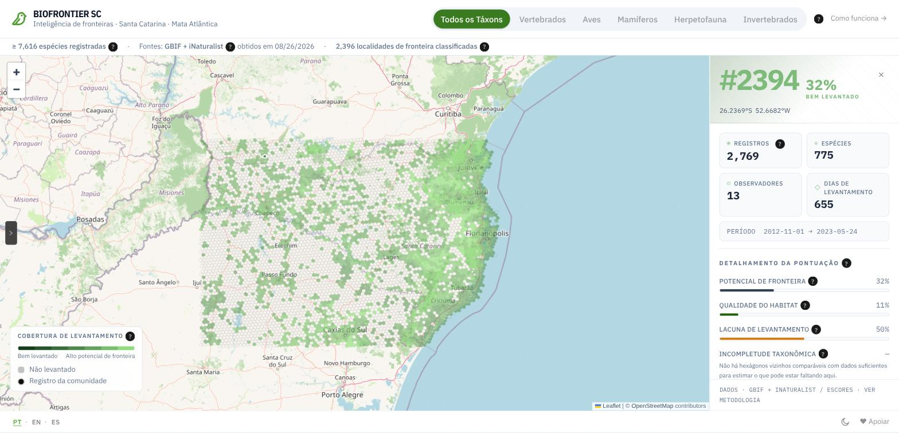

# BioFrontier SC

An open hexbin atlas of where nobody has looked yet, for Santa Catarina, Brazil.

**[biofrontier.sc.eduardofrafre.com](https://biofrontier.sc.eduardofrafre.com)**



## What this is

Biodiversity records are not spread evenly over a state. They cluster along
roads, around universities, and wherever somebody already went looking. A map
of occurrence records is therefore partly a map of species and partly a map of
effort, and the two are easy to confuse: an empty cell can mean nothing lives
there, or it can mean nobody has been.

BioFrontier SC separates them. It divides Santa Catarina into H3 hexagons and
scores each one on how thoroughly it has been surveyed, using distinct
collectors, distinct survey dates, record density and the span of years they
cover. Combined with native forest cover from MapBiomas, that produces a
ranking of places where the gap between habitat and attention is widest: the
cells most likely to repay a field trip.

The intended reader is a field biologist or a student in Santa Catarina
deciding where to go next, and the map is in Portuguese first for that reason.

**Scores are an uncalibrated hypothesis.** The weights were chosen from first
principles and have never been validated against expert judgement, so relative
ranking is more trustworthy than any absolute number. The methodology panel in
the app says so too, and shows the formula it is actually running.

**Languages:** PT-BR · EN · ES

## Contributing

Two different things are useful here.

**Observations.** Sign in through the map and submit a record against a hexbin.
Submissions are reviewed by other contributors, two independent agreements
approve one, and approved records appear as their own marker layer. They do not
feed the frontier score, which stays derived from the published datasets alone.

**Code.** Issues and pull requests are welcome. `npm test` and `npm run build`
are what CI runs, so a green local run is a green CI run. The sections below
cover the data pipeline and the architecture. If you are changing the scoring
model, `src/lib/scoring-config.ts` is the one file that owns every weight, and
the methodology panel renders its formulas from those same constants so the
published explanation cannot drift from the code.

---

## Prerequisites

- Node.js 20+
- npm
- Docker (optional, for production container and dev container)

---

## Local Development

```bash
npm install
npm run dev
```

Open [http://localhost:3000](http://localhost:3000).

---

## Dev Container

Requires VS Code with the [Dev Containers](https://marketplace.visualstudio.com/items?itemName=ms-vscode-remote.remote-containers) extension.

1. Open this folder in VS Code
2. When prompted, click **Reopen in Container**
3. `npm install` runs automatically
4. Run `npm run dev` inside the container

---

## Lint

```bash
npm run lint
```

---

## Test

```bash
npm run test            # run once
npm run test:watch      # watch mode
npm run test:coverage   # with coverage report
```

Tests cover pure scoring and geometry logic in `src/lib/`.

---

## Production Build (local)

```bash
npm run build
npm start
```

---

## Docker (production)

```bash
docker compose up --build
```

Open [http://localhost:3000](http://localhost:3000). Stop with `docker compose down`.

---

## Data Scripts

Pre-computed data is bundled in `public/data/`. To regenerate:

```bash
npm run data:habitat           # native forest cover from MapBiomas, run first
npm run data:habitat-fallback  # uniform placeholder, for working offline
npm run data:fetch             # fetch occurrences -> public/data/hexbins.json
npm run data:gbif-keys         # backfill GBIF taxon links into an existing file
```

`data:fetch` must run after one of the habitat scripts, it reads
`habitat-by-hex.json` and will refuse to start without it. It ends by resolving
the species index against the GBIF backbone, so `data:gbif-keys` is only needed
to add links to a data file generated before schema 4, or to retry after a run
where the lookup service was down.

### Occurrence sources

```bash
npm run data:fetch -- --list-sources                      # what is available
npm run data:fetch                                        # default: gbif,inaturalist
npm run data:fetch -- --sources=gbif                      # single source
npm run data:fetch -- --sources=gbif,inaturalist --max=100000
```

| Source | Auth | Notes |
|---|---|---|
| `gbif` | none | Museums, herbaria, research datasets. Also re-publishes iNaturalist research-grade records. |
| `inaturalist` | none | Research-grade observations only (community-verified IDs). |
| `specieslink` | API key | Brazilian collections, many never propagated to GBIF. Set `SPECIESLINK_API_KEY`, free registration at [specieslink.net](https://specieslink.net/). Skipped with a warning when unset. |

Records reaching us from more than one source are deduplicated on species,
rounded coordinates and date. This is not cosmetic: GBIF re-publishes
iNaturalist observations, and double-counting them would inflate the survey
effort score for exactly the well-observed areas that already dominate.

Adding a source means implementing `OccurrenceSource` in `scripts/sources/` and
registering it in `scripts/sources/index.ts`, the orchestrator needs no changes.

### Habitat data

`npm run data:habitat` computes native forest cover per hexbin from
[MapBiomas](https://mapbiomas.org/) Collection 11 (30 m, annual, 2025 by
default, `-- --year=2024` for an earlier one). Nothing needs downloading by
hand: the annual mosaics are cloud-optimised GeoTIFFs in a public bucket, so the
script reads only the tiles covering SC over HTTP. A full run takes about a
minute.

Habitat counts MapBiomas' native forest classes: Forest Formation, Savanna,
Mangrove, Floodable Forest and Wooded Sandbank Vegetation. Forest plantation
(class 9) is deliberately excluded: SC's planalto carries large pine and
eucalyptus stands, and a generic tree-cover product would score those the same
as old-growth Atlantic Forest. Natural non-forest vegetation is excluded too, so
the highland grasslands around São Joaquim score low, a real limitation of
defining this component as *forest* cover, not a data error.

Coverage is measured against land: a coastal hexbin is scored on the part of it
MapBiomas maps, and one with no land at all is omitted from the file rather than
recorded as 0% forest.

`data:habitat-fallback` remains as an offline stand-in, it writes a uniform
`0.5` for every hexbin. The app detects a uniform value, **drops the habitat
component from the frontier score**, and says so in the UI rather than
presenting a placeholder as a measurement.

### Taxon filters

Occurrences are grouped by the taxonomic class they were identified to, the
coarsest rank every source supplies reliably (GBIF `class`, iNaturalist
`iconic_taxon_name`, Darwin Core `class` in speciesLink). The mapping lives in
`src/lib/taxonomy.ts`; adapters pass the class name through rather than deciding
membership, so adding a filter is one edit there instead of one per source.

The filters overlap rather than partition the data: a toucan counts toward
Birds, Vertebrates and All Taxa, and each is scored independently, so switching
filter recomputes the ranking from scratch. Records identified only above class
level, and every plant, fungus and micro-organism, count toward All Taxa alone:
they contribute genuine survey effort, so they are never discarded, only left
ungrouped rather than guessed at.

### Species links

Each species in the detail panel links to its GBIF page. The obvious URL,
`gbif.org/species/search?q=<name>`, is broken upstream: GBIF redirects it to
`/taxon/search` and drops the query on the way, leaving the reader at an empty
search form. Numeric usage keys still resolve, so the app links
`gbif.org/species/<usageKey>`, which serves the taxon page itself.

The keys live in `speciesKeys`, parallel to `speciesIndex`, and are matched
against the GBIF backbone in `strict` mode: fuzzy and higher-rank matches are
discarded rather than pointing the reader at a plausible-looking page for a
different taxon. A species with no key falls back to `/taxon/search?q=<name>`,
which does keep its query.

### Data schema

`hexbins.json` is versioned. Schema 4 adds `speciesKeys`, the GBIF usage keys
behind those links; schema 3 keys each hexbin's taxon records by filter under
`taxa`, omitting filters with no records; schema 2 added a global
`speciesIndex` with per-hexbin `speciesIds`, plus per-source provenance.

Older files still load, without species links. Schema 2 upgrades to a two-key
`taxa` map, so the selector offers All Taxa and Vertebrates alone rather than
group filters the file cannot answer for. Schema 1 additionally reconstructs a partial species
index from the top-10 lists and flags the result as incomplete, disabling
taxonomic incompleteness scoring rather than computing it from data too sparse
to support it. See `src/lib/hexbins-file.ts`.

---

## Architecture

```
src/
├── app/[locale]/        # Next.js app router, locale routing
├── proxy.ts             # next-intl middleware (Next 16 renamed this from middleware.ts)
├── features/
│   ├── map/             # GapMap, Leaflet hex grid visualisation
│   ├── ranking/         # FrontierRanking, top 20 ranked hexbins sidebar
│   ├── detail/          # HexDetail, selected hex information panel
│   ├── controls/        # TaxonSelector, LocaleSwitcher, DataSummaryBar
│   ├── export/          # ExportButton, CSV download of the ranking
│   └── methodology/     # MethodologyPanel, scoring methodology docs
├── components/
│   ├── shell/           # AppShell, top-level layout orchestrator
│   └── ui/              # InfoTooltip, shared stateless primitives
├── hooks/               # useBiofrontierData, data fetching and derived state
├── lib/                 # Pure functions, see below
├── i18n/                # next-intl routing and request config
└── messages/            # Translation files: en, pt-BR, es

scripts/
├── fetch-occurrences.ts # Orchestrator: fetch -> dedupe -> aggregate -> write
├── compute-habitat.ts   # Native forest cover per hexbin, read from MapBiomas
├── gbif-keys.ts         # Species names -> GBIF usage keys, for taxon page links
└── sources/             # One adapter per provider behind a shared interface
```

Features do not import from each other. Cross-feature data flows through `hooks/` or props via `AppShell`.

### `src/lib/`

| Module | Responsibility |
|---|---|
| `scoring-config.ts` | **Every tunable weight lives here.** Recalibrating means editing this file and nothing else. |
| `scoring.ts` | Survey effort and composite frontier score. |
| `incompleteness.ts` | Taxonomic incompleteness against ecologically similar H3 neighbours. |
| `hexbins-file.ts` | Normalises the data file across schema versions; detects placeholder habitat data. |
| `gbif.ts` | Builds gbif.org links for a species name, with or without a usage key. |
| `csv.ts` | CSV serialisation (pure, the DOM side lives in `features/export/`). |
| `h3-utils.ts` | Hex grid geometry and neighbour lookup. |
| `color.ts` / `types.ts` | Score->colour mapping; shared types. |

### Scoring

The frontier score combines three components, weighted in `scoring-config.ts`:
survey gap, habitat quality, and taxonomic incompleteness.

Components that cannot be computed for a hexbin are **dropped, with the
remaining weights renormalised**, never treated as zero. Treating a missing
component as zero would push data-poor hexbins down the ranking, and data-poor
hexbins are precisely what the tool exists to surface.

The weights are an uncalibrated hypothesis. `scoring-config.ts` documents what
that means for interpreting the output.

## Licence and attribution

The source is MIT. See [LICENSE](LICENSE).

That covers the code. It does **not** cover the derived data files under
`public/data/`, which are computed from GBIF and iNaturalist occurrence records
and MapBiomas land cover and carry those sources' terms. The bird mark is
Phosphor Icons' work under its own MIT grant, and basemap tiles are ©
OpenStreetMap contributors under ODbL, the attribution control on the map
satisfies that and must not be removed.

[THIRD-PARTY-NOTICES.md](THIRD-PARTY-NOTICES.md) has the detail and the notices
these require.
